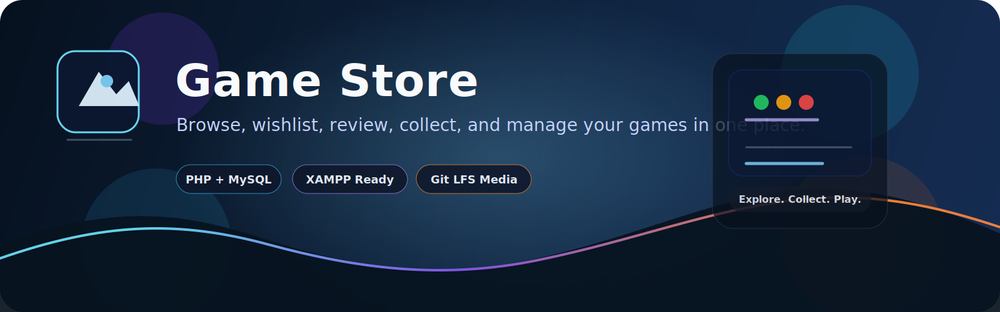

# Game Store




A full-featured PHP and MySQL game store built for XAMPP.  
It includes browsing, game details, wishlist and library management, user profiles, collections, reviews, notifications, email verification, and password reset.

## Highlights

- Clean homepage with game cards and featured content
- Browse page with search, filters, and sorting
- Game details page with related games and trailers
- Wishlist and library system for signed-in users
- Profile page with editable user information
- Recently viewed games tracking
- Review and rating system
- Custom collections for organizing games
- Notifications center for important activity
- Email verification and password reset flows
- Light and dark theme toggle
- Admin dashboard for managing games and users

## What Makes It Cool

- Trailer videos are included for a richer game-store feel
- User activity is tracked so the site feels more personal
- Collections let users organize games in a way that suits them
- Reviews and ratings make the store feel interactive
- Notifications help users stay aware of account and content changes
- Theme switching gives the site a more modern feel

## Tech Stack

- PHP
- MySQL / MariaDB
- HTML
- CSS
- JavaScript
- XAMPP
- Git LFS for large video assets

## Project Structure

- `index.php` - homepage
- `browse.php` - browse and filter games
- `view_game.php` - game details page
- `profile.php` - user profile and account settings
- `collections.php` - custom collections
- `wishlist.php` - saved games
- `library.php` - owned or added games
- `notifications.php` - user notifications
- `setup_database.php` - database installer and upgrader
- `admin/` - admin panel and management tools
- `images/` - game cover images
- `Video/` - trailer videos

## Features In Detail

### User Features

- Register and log in
- Email verification
- Password reset
- Update profile details
- Add games to wishlist
- Add games to library
- Create and manage collections
- Leave reviews and star ratings
- View recently opened games

### Store Features

- Browse all games
- Search by title or keyword
- Filter and sort game listings
- View related games on the details page
- Watch trailers directly from the store

### Admin Features

- Add new games
- Edit existing games
- Delete games
- View user data
- Manage store content

## Quick Start

1. Copy the project folder into your XAMPP web root.
2. Start Apache and MySQL in XAMPP.
3. Open `setup_database.php` in your browser once to create or upgrade the database tables.
4. Open the project in your browser.

Example local URL:

```text
http://localhost/Game_Store/
```

## Live Demo

This project is currently set up for local XAMPP use, so the demo runs on your own machine.

- Local demo: `http://localhost/Game_Store/`
- Public live demo: not deployed yet

If you publish the site later, replace this section with your hosted URL.

## Default Admin Login

- Username: `admin`
- Password: `admin123`

## Database Setup

The project uses `setup_database.php` to create the database schema and apply upgrades.

Run it again if you:

- add a new table
- rename a column
- update the login or profile schema
- change the seed data

## Git LFS Notes

Large trailer files are stored with Git LFS so the repository can stay on GitHub.

If you clone this project on another machine, run:

```bash
git lfs install
git lfs pull
```

## Screenshots

Add your best project screenshots here to make the repository look more professional:

- Homepage
- Browse page
- Game details page
- Profile page
- Admin dashboard

## Recommended Improvements

- Add more game categories
- Add a favorites section
- Add admin review moderation
- Add notifications for price or content updates
- Add richer analytics in the admin panel

## Troubleshooting

- If the profile page shows a missing column error, run `setup_database.php` again.
- If trailer files do not appear after cloning, make sure Git LFS is installed.
- If login does not work, confirm Apache and MySQL are running in XAMPP.

## License

This project is for personal and educational use unless you add a license file.
